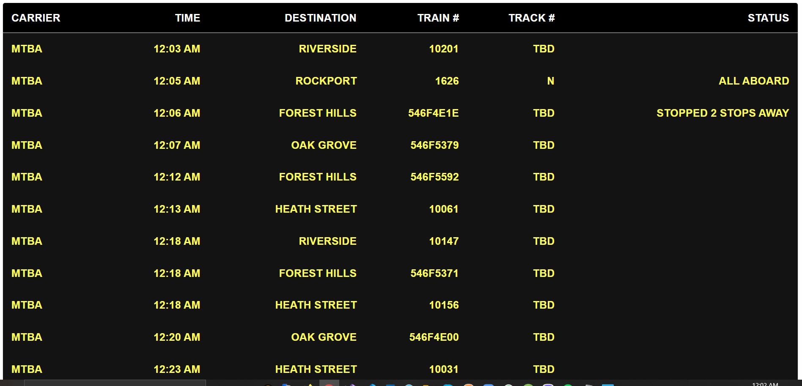

To have installed:

- Nodejs

  ```
  https://nodejs.org/en/download/
  ```

Install requirements

```
npm install
```

How to run app

```
npm run start
```

How to run tests

```
npm run test
```

Enviroment

To provide your own api key mtba please added to .env
a new variable with the name REACT_APP_MBTA_APIKEY


